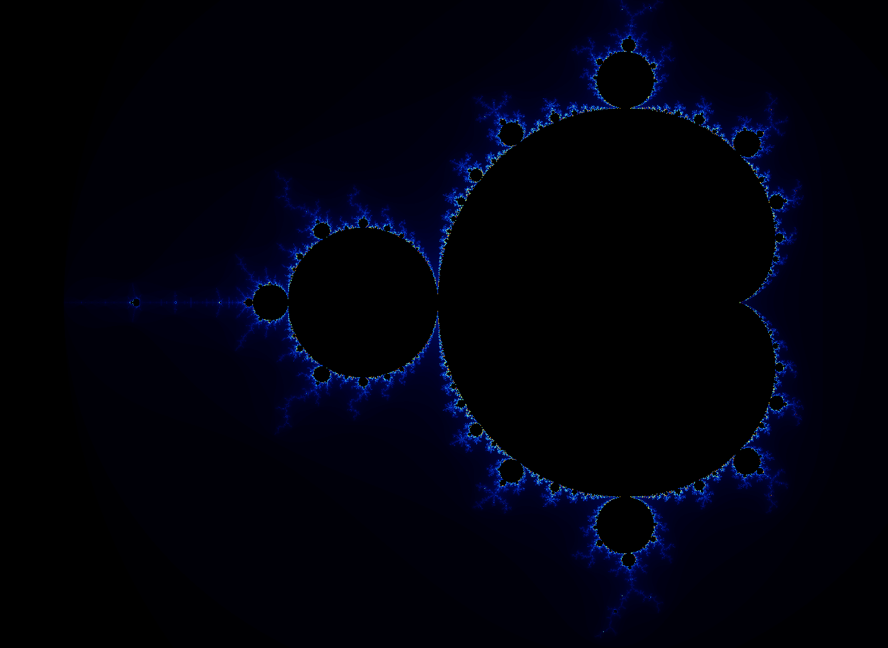
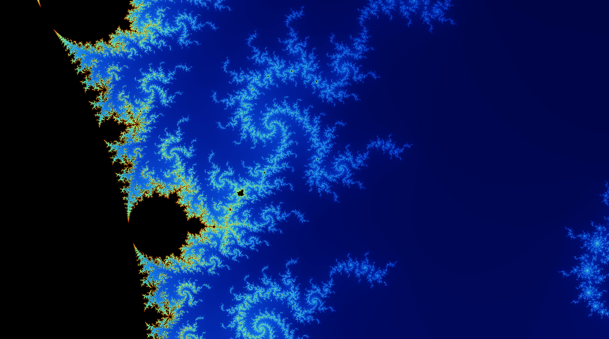

# Mandelbrot fractal

# Requirements
* C++ compiler
* [GLFW 3](https://www.glfw.org/)
* [GLEW](http://glew.sourceforge.net/)

# Building 
Simply run these commands

`> cd Release`

`> cmake ..`

`> make`

# Usage
You can use WASD to move around and mouse scroll to zoom in or out.
If you want to increase or decrease the simulation's resolution, use + or - respectively.
